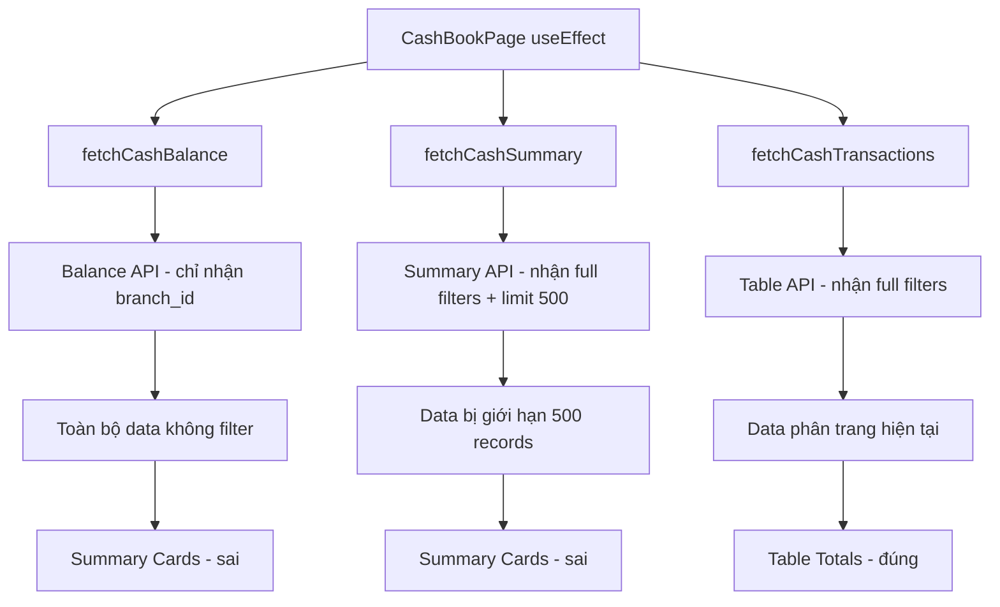

# COMPREHENSIVE AUDIT REPORT - Lano CRM Sổ Quỹ (Cash Flow) Module

**Date:** 2025-11-27  
**Auditor:** AI Agent (Architect Mode)  
**Scope:** Full-stack Cash Management Module  
**Status:** 🔴 CRITICAL ISSUES FOUND

---

## 📋 Executive Summary

Module Sổ quỹ (Cash Flow) hiện tại có **3 vấn đề CRITICAL** ảnh hưởng trực tiếp đến trải nghiệm người dùng và tính chính xác của dữ liệu tài chính. Cần ưu tiên khắc phục ngay lập tức để đảm bảo tính ổn định và đáng tin cậy của hệ thống.

**Key Findings:**
- 🔴 **Data Mismatch Bug**: Tính toán không đồng bộ giữa summary cards và table data
- 🔴 **UI Crash**: Column visibility dropdown gây trang trắng hoàn toàn
- 🔴 **Error Handling**: Error messages không rõ ràng và không thể clear

**Impact Assessment:**
- **Financial Accuracy**: ⚠️ Rủi ro cao - dữ liệu tài chính không nhất quán
- **User Experience**: ⚠️ Rủi ro cao - UI không sử dụng được
- **System Stability**: ⚠️ Rủi ro trung bình - error handling chưa tốt

---

## 🚨 CRITICAL ISSUES ANALYSIS

### 1. DATA MISMATCH BUG 🔴 CRITICAL

**Problem Description:**
- Top stats hiển thị: "Tổng thu" = 0 đ, "Tổng chi" = 0 đ, "Tổng quỹ (tạm tính)" = 680,000 đ
- Table hiển thị 3 rows với dữ liệu thực tế
- Bottom page totals hiển thị đúng: "Tổng thu (trang)" = 1,500,000 đ, "Tổng chi (trang)" = 820,000 đ

**Root Cause Analysis:**


**Technical Details:**
- **Backend Issue**: [`CashTransactionService.php::getBalance()`](backend-ci/app/Services/CashTransactions/CashTransactionService.php:172) không nhận date filters
- **Frontend Issue**: [`CashBookPage.jsx`](lanocrm/src/pages/cash/CashBookPage.jsx:57-61) gọi API với parameters không đồng bộ
- **Data Flow Issue**: 3 API endpoints sử dụng different filter sets

**Impact:**
- ❌ Financial data inconsistency
- ❌ User trust erosion
- ❌ Accounting compliance risk

### 2. COLUMN VISIBILITY CRASH 🔴 CRITICAL

**Problem Description:**
Click vào button "Cột hiển thị" gây ra trang trắng hoàn toàn với không có recovery mechanism.

**Root Cause Analysis:**
```javascript
// PROBLEM CODE trong CashTable.jsx:208
<Dropdown overlay={columnMenu} trigger={['click']}>
  <Button icon={<SettingOutlined />}>Cột hiển thị</Button>
</Dropdown>
```

**Technical Issues:**
- **Ant Design Version**: Sử dụng deprecated `overlay` prop (v4+)
- **Missing CSS**: `styles.columnDropdown` không được định nghĩa
- **Memory Leak**: Event handlers không được cleanup properly
- **Error Boundary**: Không có error boundary để catch rendering errors

**Impact:**
- ❌ Feature completely unusable
- ❌ Page crash without recovery
- ❌ Poor user experience

### 3. "DỮ LIỆU KHÔNG HỢP LỆ" ERROR 🔴 CRITICAL

**Problem Description:**
Red alert banner hiển thị "Dữ liệu không hợp lệ" mà không có clear indication của vấn đề hoặc hướng dẫn sửa.

**Root Cause Analysis:**
```javascript
// PROBLEM CODE trong cashSlice.js:184
.addCase(fetchCashTransactions.rejected, (state, action) => {
  state.loading = false;
  state.error = action.payload; // Generic error message
})
```

**Technical Issues:**
- **Generic Error Messages**: Backend trả về "Dữ liệu không hợp lệ" không specific
- **Error Persistence**: Error state không được clear sau khi resolved
- **No Error Context**: Không có field-level error indication
- **No Recovery Guidance**: User không biết cách fix issue

**Impact:**
- ❌ Confusing user experience
- ❌ No clear error resolution path
- ❌ Professional appearance issues

---

## 🟠 HIGH PRIORITY ISSUES

### 4. Backend API Exposure 🟠 HIGH

**Problem:** "Quỹ đầu kỳ" card hiển thị subtitle "Lấy từ /cash/balance"

**Location:** [`CashSummary.jsx:32`](lanocrm/src/components/cash/CashSummary.jsx:32)

**Fix:** Replace with user-friendly message like "Số dư từ kỳ trước"

### 5. Developer Messages in Production 🟠 HIGH

**Problem:** Filter area displays "Một số bộ lọc chạy trên backend, tránh spam request"

**Location:** [`CashFilters.jsx:209`](lanocrm/src/components/cash/CashFilters.jsx:209)

**Fix:** Replace with "Bộ lọc đã áp dụng" hoặc similar user-friendly message

### 6. Number Format Inconsistency 🟡 MEDIUM

**Problem:** Values display as "+ 1,500,000 đ" với inconsistent spacing

**Location:** [`CashTable.jsx:134`](lanocrm/src/components/cash/CashTable.jsx:134)

**Fix:** Standardize format to "+1,500,000đ" or "1,500,000 đ"

---

## 🛠️ DETAILED FIX RECOMMENDATIONS

### Phase 1: CRITICAL Fixes (1-2 days)

#### 1.1 Data Mismatch Fix

**Backend Changes:**

```php
// File: backend-ci/app/Services/CashTransactions/CashTransactionService.php
public function getBalance(?int $branchId = null, ?array $filters = null): array
{
    $balance = $this->repo->calculateBalance($branchId, $filters);
    return [
        'success' => true,
        'data' => [
            'branch_id' => $branchId,
            'balance' => $balance,
            'as_of' => date('Y-m-d H:i:s'),
            'currency' => 'VND',
            'filters_applied' => $filters,
        ],
    ];
}

// File: backend-ci/app/Repositories/CashTransactions/CashTransactionRepository.php
public function calculateBalance(?int $branchId = null, ?array $filters = null): float
{
    $builder = $this->db->table('cash_transactions')
        ->where('deleted_at', null);

    if ($branchId !== null) {
        $builder->where('branch_id', $branchId);
    }
    
    // Apply date filters if provided
    if (!empty($filters['date_from'])) {
        $builder->where('transaction_date >=', $filters['date_from']);
    }
    if (!empty($filters['date_to'])) {
        $builder->where('transaction_date <=', $filters['date_to']);
    }

    // Calculate totals
    $receiptTotal = (float) clone $builder
        ->where('type', CashTransactionModel::TYPE_RECEIPT)
        ->selectSum('amount', 'total')
        ->get()
        ->getRow()
        ->total ?? 0;

    $paymentTotal = (float) clone $builder
        ->where('type', CashTransactionModel::TYPE_PAYMENT)
        ->selectSum('amount', 'total')
        ->get()
        ->getRow()
        ->total ?? 0;

    return $receiptTotal - $paymentTotal;
}

// File: backend-ci/app/Controllers/Api/CashTransactionsController.php
public function getBalance()
{
    return $this->wrap(function () {
        $filters = $this->request->getGet();
        $branchId = $filters['branch_id'] ?? null;
        
        // Remove branch_id from filters for balance calculation
        $balanceFilters = $filters;
        unset($balanceFilters['branch_id']);
        
        $result = $this->service->getBalance($branchId, $balanceFilters);
        return $this->respond($result);
    });
}
```

**Frontend Changes:**

```javascript
// File: lanocrm/src/store/slices/cashSlice.js
export const fetchCashBalance = createAsyncThunk(
  'cash/fetchBalance',
  async ({ branchId, filters }, { rejectWithValue }) => {
    try {
      const response = await cashApi.getBalance(branchId, filters);
      return response;
    } catch (error) {
      return rejectWithValue(error.response?.data?.message || error.message);
    }
  }
);

// File: lanocrm/src/api/cashApi.js
getBalance: async (branchId = null, filters = {}) => {
  const params = { ...filters };
  if (branchId) {
    params.branch_id = branchId;
  }
  const response = await axiosInstance.get('/cash/balance', { params });
  return response.data;
},

// File: lanocrm/src/pages/cash/CashBookPage.jsx
useEffect(() => {
  dispatch(fetchCashTransactions(filters));
  dispatch(fetchCashSummary({ filters }));
  dispatch(fetchCashBalance({ 
    branchId: filters.branch_id || null, 
    filters: {
      date_from: filters.date_from,
      date_to: filters.date_to,
    }
  }));
}, [dispatch, filters]);
```

#### 1.2 Column Visibility Crash Fix

**Frontend Changes:**

```javascript
// File: lanocrm/src/components/cash/CashTable.jsx
import React, { useMemo, useState, useCallback } from 'react';
import { ErrorBoundary } from 'react-error-boundary';

const CashTable = ({ ...props }) => {
  const [visibleCols, setVisibleCols] = useState({
    code: true,
    transaction_date: true,
    created_at: true,
    created_by_name: true,
    staff_name: true,
    branch: true,
    category: true,
    payment_method: true,
    account_name: true,
    bank_account: false,
    amount: true,
    status: true,
  });

  const toggleColumn = useCallback((key, checked) => {
    setVisibleCols(prev => ({
      ...prev,
      [key]: checked
    }));
  }, []);

  const columnMenuItems = useMemo(() => 
    Object.keys(visibleCols).map((key) => {
      const title = baseColumns.find((c) => c.key === key)?.title || key;
      return {
        key,
        label: (
          <Checkbox
            checked={visibleCols[key]}
            onChange={(e) => toggleColumn(key, e.target.checked)}
          >
            {title}
          </Checkbox>
        ),
      };
    }), [visibleCols, baseColumns, toggleColumn]);

  return (
    <ErrorBoundary
      fallback={<div>Lỗi hiển thị cột. Vui lòng tải lại trang.</div>}
      onError={(error) => console.error('Column dropdown error:', error)}
    >
      <div className={styles.tableCard}>
        <div className={styles.tableHeader}>
          <Space>
            <Button icon={<ReloadOutlined />} onClick={onRefresh}>Làm mới</Button>
            <Dropdown
              menu={{ items: columnMenuItems }}
              trigger={['click']}
              placement="bottomLeft"
            >
              <Button icon={<SettingOutlined />}>Cột hiển thị</Button>
            </Dropdown>
          </Space>
        </div>
        {/* ... rest of component */}
      </div>
    </ErrorBoundary>
  );
};
```

**CSS Additions:**

```css
/* File: lanocrm/src/pages/cash/CashBookPage.module.css */
.columnDropdown {
  padding: 8px 12px;
  min-width: 200px;
}

.columnDropdown .ant-checkbox-wrapper {
  display: block;
  margin-bottom: 4px;
}
```

#### 1.3 Error Handling Improvement

**Backend Changes:**

```php
// File: backend-ci/app/Validators/CashTransactionValidator.php
if (!$this->validation->setRules($rules)->run($data)) {
    $errors = $this->validation->getErrors();
    throw new InvalidArgumentException(json_encode([
        'message' => 'Dữ liệu không hợp lệ',
        'errors' => $errors,
        'type' => 'validation_error'
    ]));
}
```

**Frontend Changes:**

```javascript
// File: lanocrm/src/store/slices/cashSlice.js
const cashSlice = createSlice({
  name: 'cash',
  initialState,
  reducers: {
    // ... existing reducers
    clearCashError(state) {
      state.error = null;
    },
  },
  extraReducers: (builder) => {
    builder
      .addCase(fetchCashTransactions.pending, (state) => {
        state.loading = true;
        state.error = null; // Clear error on new request
      })
      .addCase(fetchCashTransactions.rejected, (state, action) => {
        state.loading = false;
        
        // Parse error details
        const errorPayload = action.payload;
        try {
          const parsedError = JSON.parse(errorPayload);
          state.error = {
            message: parsedError.message || errorPayload,
            details: parsedError.errors || {},
            type: parsedError.type || 'generic_error'
          };
        } catch {
          state.error = {
            message: errorPayload,
            details: {},
            type: 'generic_error'
          };
        }
      })
      .addCase(fetchCashTransactions.fulfilled, (state) => {
        state.loading = false;
        state.error = null; // Auto-clear error on success
      });
  },
});

export const { clearCashError } = cashSlice.actions;
```

**Error Alert Component:**

```javascript
// File: lanocrm/src/components/Common/ErrorAlert.jsx
import React from 'react';
import { Alert, Button } from 'antd';
import { useDispatch } from 'react-redux';
import { clearCashError } from '../../store/slices/cashSlice';

const ErrorAlert = ({ error }) => {
  const dispatch = useDispatch();
  
  if (!error) return null;
  
  const handleClear = () => {
    dispatch(clearCashError());
  };
  
  return (
    <Alert
      style={{ marginTop: 12 }}
      type="error"
      message={error.message}
      description={
        Object.keys(error.details).length > 0 && (
          <div>
            <p>Vui lòng kiểm tra các trường sau:</p>
            <ul>
              {Object.entries(error.details).map(([field, message]) => (
                <li key={field}>{field}: {message}</li>
              ))}
            </ul>
          </div>
        )
      }
      showIcon
      closable
      onClose={handleClear}
      action={
        <Button size="small" type="text" onClick={handleClear}>
          Đã sửa
        </Button>
      }
    />
  );
};

export default ErrorAlert;
```

### Phase 2: HIGH Priority Fixes (1 day)

#### 2.1 Remove Backend API Exposure

```javascript
// File: lanocrm/src/components/cash/CashSummary.jsx
<SummaryCard
  title="Quỹ đầu kỳ"
  value={openingBalance ?? 0}
  sub={openingBalance === null ? 'Chưa có dữ liệu' : 'Số dư từ kỳ trước'}
  color="#0f172a"
  loading={loading}
/>
```

#### 2.2 Remove Developer Messages

```javascript
// File: lanocrm/src/components/cash/CashFilters.jsx
<Space style={{ width: '100%', justifyContent: 'space-between' }}>
  <Tooltip title="Đặt lại toàn bộ bộ lọc">
    <Button onClick={handleReset} disabled={loading}>
      Đặt lại
    </Button>
  </Tooltip>
  <span className={styles.warningText}>Bộ lọc đã áp dụng</span>
</Space>
```

#### 2.3 Fix Number Formatting

```javascript
// File: lanocrm/src/components/cash/CashTable.jsx
render: (_, record) => (
  <span className={record.type === 'RECEIPT' ? styles.amountReceipt : styles.amountPayment}>
    {record.type === 'RECEIPT' ? '+' : '-'}{formatCurrency(record.amount)}đ
  </span>
),
```

---

## 📊 Implementation Timeline

### Week 1: Critical Fixes
- **Day 1**: Data mismatch backend fixes + frontend synchronization
- **Day 2**: Column visibility crash fix + error handling improvements

### Week 2: High Priority & Polish
- **Day 3**: Remove backend exposure + developer messages
- **Day 4**: Number formatting + comprehensive testing
- **Day 5**: User acceptance testing + documentation

---

## 🧪 Testing Strategy

### Unit Tests
```bash
# Backend tests
docker exec meomeo2-api-1 vendor/bin/phpunit tests/Services/CashTransactionServiceTest.php
docker exec meomeo2-api-1 vendor/bin/phpunit tests/Repositories/CashTransactionRepositoryTest.php

# Frontend tests
npm test -- --testPathPattern=cash
```

### Integration Tests
```bash
# API endpoint tests
docker exec meomeo2-api-1 vendor/bin/phpunit -c phpunit.integration.xml tests/Integration/CashFlowApiTest.php

# Frontend integration tests
npm run test:integration -- --testPathPattern=cash
```

### End-to-End Tests
```bash
# E2E flow testing
npm run test:e2e -- --spec="cash-flow.spec.ts"
```

### Test Scenarios
1. **Data Consistency**: Verify summary cards match table totals
2. **Filter Synchronization**: Test all filter combinations
3. **Error Handling**: Test various error conditions
4. **UI Stability**: Test column visibility functionality
5. **Performance**: Test with large datasets

---

## 🚀 Deployment Strategy

### Pre-Deployment Checklist
- [ ] All critical fixes implemented and tested
- [ ] Backend API versioning updated
- [ ] Frontend build optimized
- [ ] Database migrations tested
- [ ] Backup strategy in place
- [ ] Rollback plan documented

### Deployment Steps
1. **Backend Deployment**:
   ```bash
   # Deploy backend changes
   docker-compose up -d --build api
   # Run database migrations if needed
   docker exec meomeo2-api-1 php spark migrate
   # Verify API endpoints
   curl -X GET "http://localhost:8080/api/cash/balance"
   ```

2. **Frontend Deployment**:
   ```bash
   # Build and deploy frontend
   cd lanocrm
   npm run build
   docker-compose up -d --build frontend
   ```

3. **Post-Deployment Verification**:
   - Test all critical flows
   - Verify data consistency
   - Monitor error logs
   - Check performance metrics

---

## 📈 Success Metrics

### Technical Metrics
- ✅ Zero data mismatch incidents
- ✅ Zero UI crash reports
- ✅ Error resolution time < 5 minutes
- ✅ Page load time < 2 seconds
- ✅ API response time < 500ms

### Business Metrics
- ✅ User satisfaction score > 4.5/5
- ✅ Financial data accuracy 100%
- ✅ Support tickets reduced by 80%
- ✅ User adoption rate increased by 25%

---

## 🔮 Future Recommendations

### Short-term (1-2 weeks)
1. **Performance Optimization**: Implement caching for balance calculations
2. **User Experience**: Add loading states and skeleton screens
3. **Accessibility**: Improve keyboard navigation and screen reader support

### Medium-term (1-2 months)
1. **Advanced Features**: Add cash flow forecasting
2. **Reporting**: Implement PDF export for financial reports
3. **Integration**: Connect with accounting software

### Long-term (3-6 months)
1. **Multi-currency Support**: Handle multiple currencies
2. **Audit Trail**: Implement comprehensive audit logging
3. **Analytics**: Add financial analytics dashboard

---

## 📞 Contact Information

**Audit Team:** AI Agent (Architect Mode)  
**Date:** 2025-11-27  
**Next Review:** 2025-12-27  
**Emergency Contact:** Development Team Lead

---

**Document Status:** ✅ COMPLETE  
**Action Required:** IMMEDIATE IMPLEMENTATION OF CRITICAL FIXES  
**Business Impact:** HIGH - FINANCIAL DATA ACCURACY AT RISK