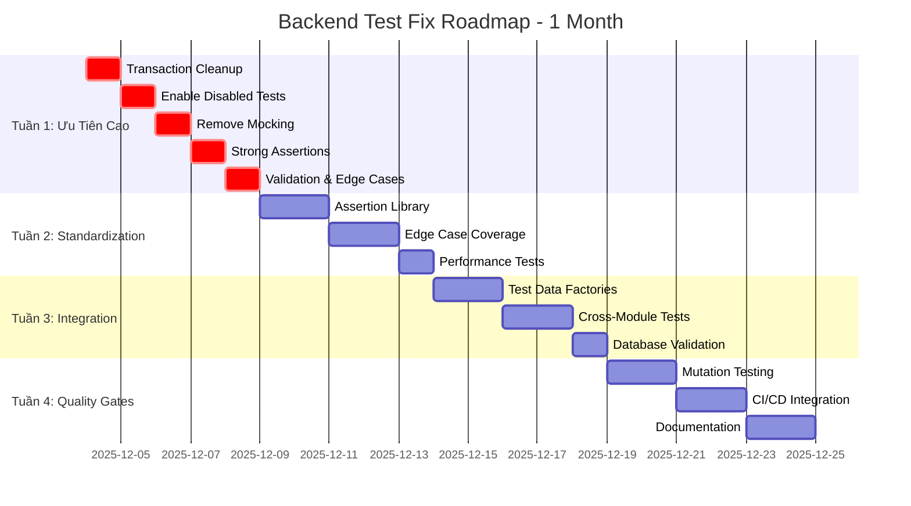
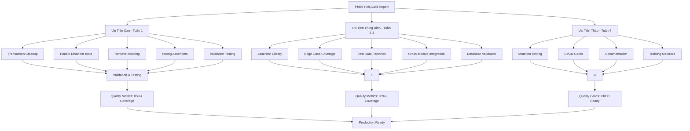
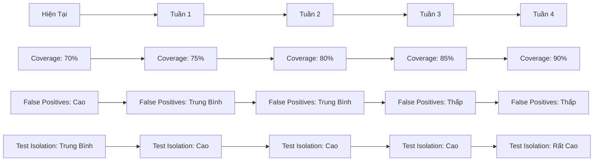
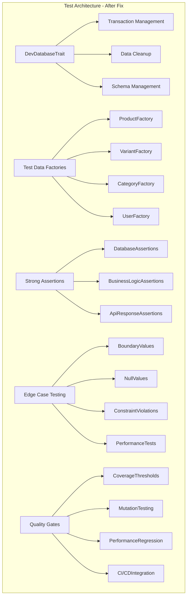
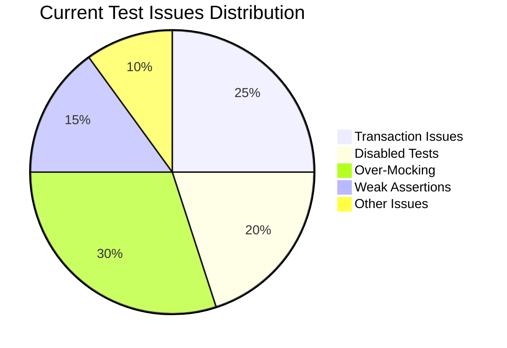
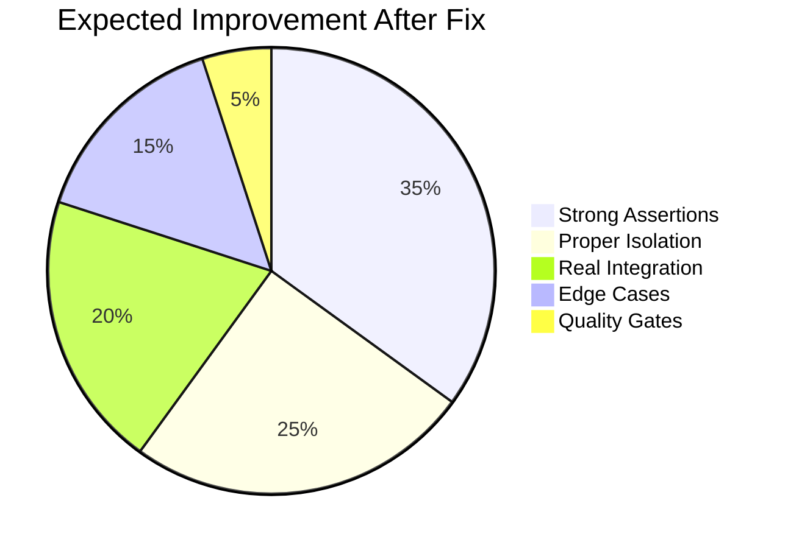
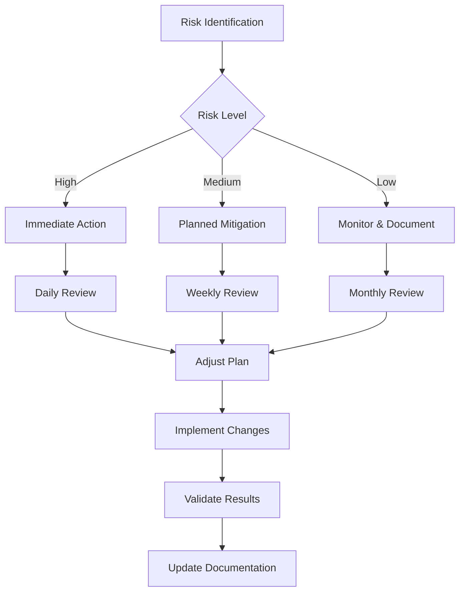
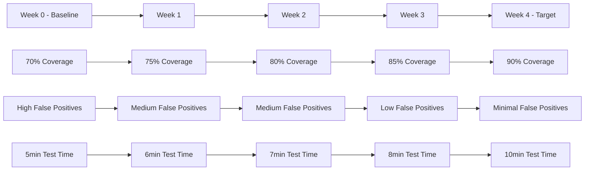
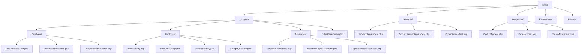

# Backend Test Fix Roadmap - Visual Diagram

**Ngày tạo:** 2025-12-03  
**Mục tiêu:** Trực quan hóa lộ trình sửa chữa backend tests  

---

## 🗺️ Lộ Trình Tổng Quan

---

## 🔄 Quy Trình Sửa Chữa

---

## 🎯 Mục Tiêu Chất Lượng

---

## 🔧 Kiến Trúc Test Mới

---

## 📊 Impact Analysis

---

## 🚨 Risk Mitigation Flow

---

## 📈 Success Metrics Timeline

---

## 🔗 Files Structure After Fix

---

**Key Insights:**
1. **Tuần 1 là quan trọng nhất** - fix các vấn đề nền tảng
2. **Progressive improvement** - mỗi tuần xây dựng trên tuần trước
3. **Quality gates** - đảm bảo không regressions
4. **Sustainable patterns** - tạo foundation cho tương lai

**Next Steps:** Bắt đầu implement Tuần 1 ngay lập tức để giải quyết các vấn đề nghiêm trọng nhất.